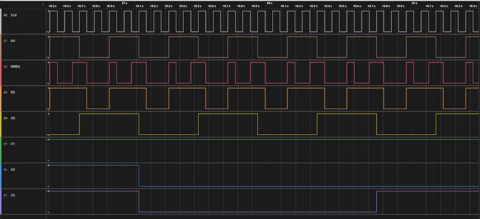

# Z80-Arduino test

Connect Arduino Nano to Z80 CPU and use it as buffer for LEDs.

## Pin connections

|  Z80 |  Arduino Inputs|  Arduino Outputs|
|------|----------------|-----------------|
|  M1  |      2         |         4       |
|  MREQ|      A0        |         5       |
|  RD  |      A1        |         6       |
|  WR  |      A2        |         7       |
|  A0  |      3         |         8       |
|  A1  |      A3        |         9       |
|  A2  |      A4        |         10      |
|  A3  |      A5        |         11      |

## Start

- Power ON

- Check LEDs outputs

- Press reset a few seconds

- See Outputs on LEDs

## Timing diagram
You can connect the logical probe to CPU pins

